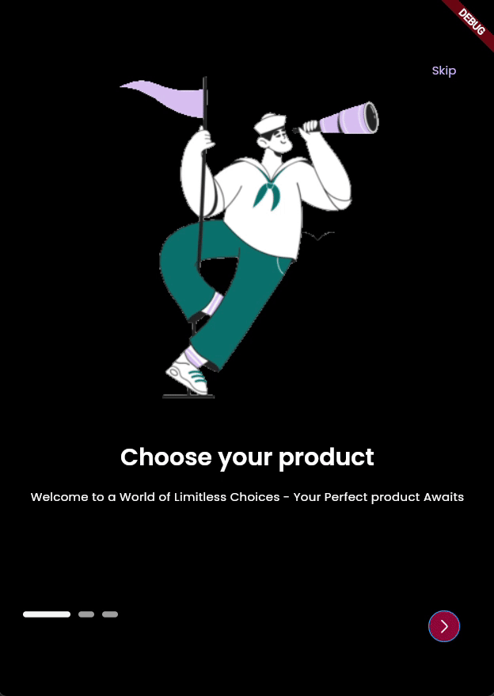

# ClickBuy — Smart Shopping (Flutter)

ClickBuy is a Flutter e-commerce app that brings multiple shops into one place for smarter product discovery.  
It integrates external store APIs, Google Vision (image search), and Firebase for data.

> ⚠️ The admin website is private (not included).  
> This repo contains the **Flutter mobile app only**.

---

## Demo
- [Watch demo video](docs/media/demo.mp4)
- Preview GIF:  
   

## Screenshots
| OnBoarding                               | Home                         | Login                          | Product                             | Product Details                                    | Checkout                             | 
|------------------------------------------|------------------------------|--------------------------------|-------------------------------------|----------------------------------------------------|--------------------------------------|
|  |  |  |  |  |  |

---

## Features
- 🛍️ Unified shopping across multiple stores
- 🔎 Image-based search with Google Vision
- 💾 Firebase integration (Firestore, Auth, Storage)
- 🧩 Modular Flutter architecture

---

## Tech Stack
- Flutter (Dart)
- Firebase (Firestore / Auth / Storage)
- Google Vision API
- State management: GetX 

---

## Run Locally

### Prerequisites
- Flutter SDK installed
- Firebase project created
- Google Vision API enabled
- Fake Store Api (for testing)

### Setup
1. Clone the repo:
   ```bash
   git clone https://github.com/Noureddin-Awwad/clickbuy
   cd clickbuy
   
2. Install dependencies:
   flutter pub get

3. Add Firebase configs:

- Put your google-services.json inside android/app/
- Put your GoogleService-Info.plist inside ios/Runner/

4. Run the app:
   flutter run


